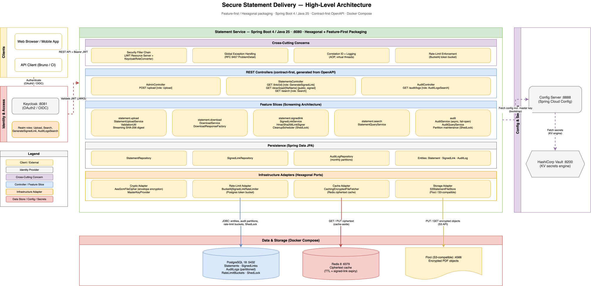
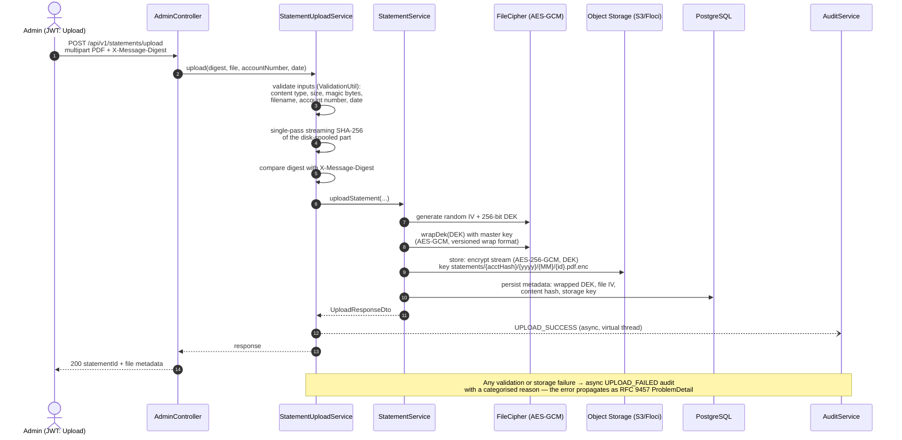
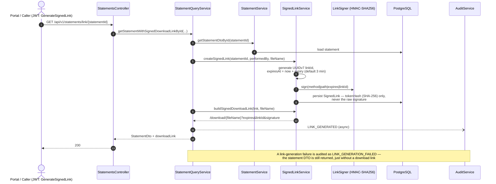
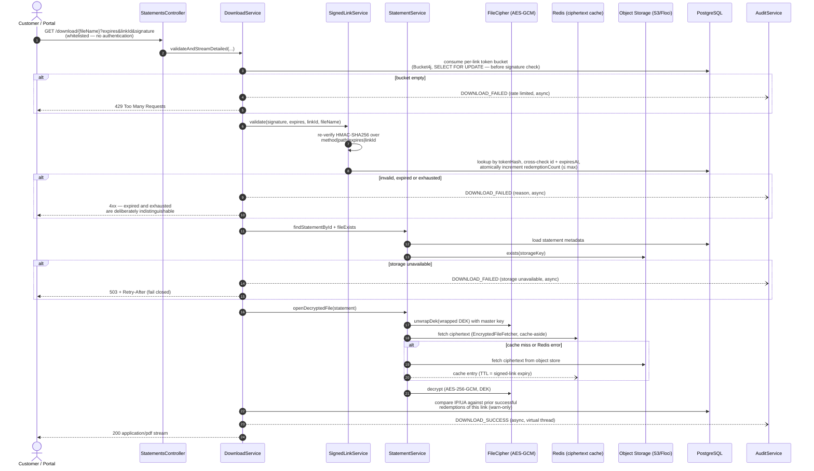
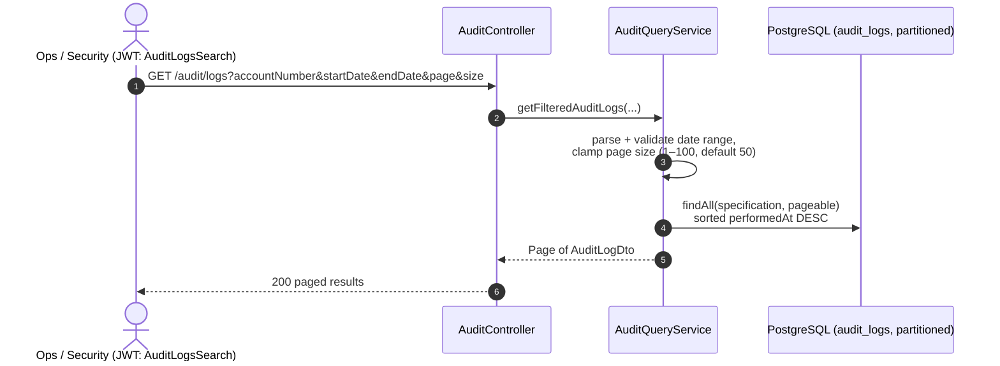
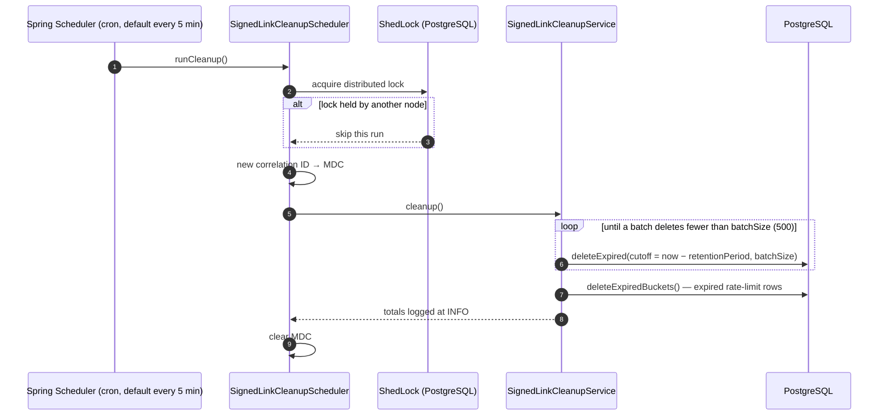
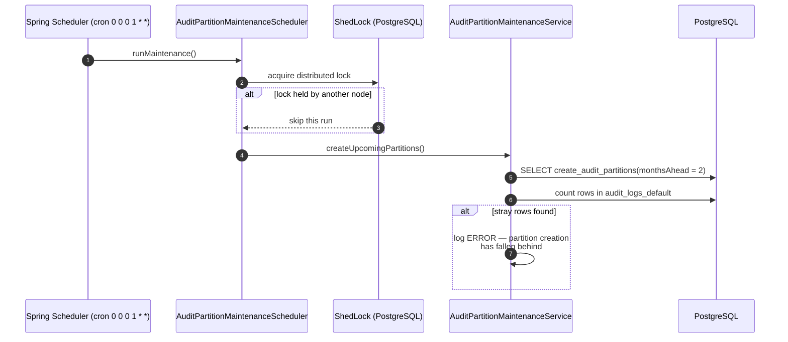

### Architecture Overview

This document describes the architecture of the **Secure Statement Delivery Platform**, focusing on the `statement-service` component that implements secure file statement delivery with time‑limited, signed, multi‑redemption download links and full auditing.

### Summary

The **Secure Statement Delivery Platform** implements a robust, production‑grade architecture for secure file statement delivery:

- **Statement upload** with strict validation, single-pass streaming digest verification, and per‑file **envelope encryption** (AES‑GCM) at rest.
- **Time‑limited, signature-verified download links** with a bounded redemption count, Redis-backed rate limiting, and cluster‑safe cleanup.
- **Comprehensive audit logging** of uploads, downloads, and link usage, enriched with client and user context, written asynchronously and partitioned monthly.
- **Strong security model** using Keycloak, JWT, config‑driven role‑based authorisation, and careful file‑handling practices.
- **Operational maturity** with distributed locking, health groups that isolate degraded dependencies from availability, a ciphertext cache, logging aspects, correlation IDs, actuator endpoints, and a GitHub Actions CI pipeline.

---

### High-Level Architecture Diagram

---

### High‑Level System Context

#### Main Components

- **statement-service** (Spring Boot 4 / Java 25, `:8080`)
    - Uploads and envelope-encrypts monthly account statements (PDF)
    - Stores statement metadata and encrypted files (Floci/S3-compatible object storage)
    - Generates and validates **time‑limited, multi‑redemption signed download links**
    - Streams decrypted statements for download, via a Redis-backed ciphertext cache
    - Produces and exposes **audit logs** for uploads, downloads, and link usage

- **config-server** (Spring Cloud Config, `:8888`)
    - Centralises configuration for `statement-service` and other services
    - Reads properties from a Git‑style config repo (`infra/config-repo`)
    - Is the **only** component that talks to Vault directly (composite property source)

- **PostgreSQL 18** (`:5432`)
    - Primary relational database for `statement-service`
    - Stores statements, signed links, audit logs (monthly partitioned), rate-limit buckets, and ShedLock coordination rows

- **Redis 8** (`:6379`)
    - Backs the **ciphertext cache** only (`statementCiphertext`), keyed by object storage key, TTL matched to the signed-link expiry
    - Deliberately excluded from the readiness health group — a Redis outage degrades cache hit rate, not availability

- **HashiCorp Vault** (`:8200`)
    - Stores the **encryption master key** and other secrets
    - Reachable only from `config-server`; `statement-service` never calls Vault directly — it receives the master key as a config property (or a mounted secret file as a fallback) at bootstrap

- **Keycloak** (`:8081`)
    - Identity provider (OAuth2 / OpenID Connect)
    - Issues JWT access tokens with realm roles for admins and other calling systems

- **Infra / Docker Compose**
    - Orchestrates Postgres, Redis, Vault, Keycloak, Config Server, Floci, and `statement-service` for local/dev
    - Provides a reproducible environment for development and testing

#### External Actors

- **Admin User / Backoffice System**
    - Calls the **upload endpoint** to register monthly account statements as PDFs
    - Uses a Keycloak‑issued JWT with roles (e.g. `Upload`, `GenerateSignedLink`, `AuditLogsSearch`)

- **Customer Portal / Downstream System**
    - Calls APIs to request **signed download links** for statements
    - Uses a JWT with appropriate role(s), typically `GenerateSignedLink` or `Search`

- **Operations & Security Teams**
    - Query **audit logs** for investigations and compliance
    - Monitor logs, metrics, and health endpoints (readiness/liveness groups)

---

### Core Use Cases and Flows

#### 1. Upload Monthly Statement (Admin)

1. **Admin** obtains a JWT from Keycloak with the `Upload` role.
2. Admin computes `SHA-256` digest of the PDF and calls:
    - `POST /api/v1/statements/upload`
    - Headers: `Authorization: Bearer <token>`, `X-Message-Digest: <hex digest>`
    - Multipart form: `file` (PDF), `accountNumber`, `date`
3. `AdminController` delegates to `StatementUploadService` which:
    - Validates **content type** (`application/pdf`), file **size** (10MB cap), and the PDF magic-byte signature
    - Validates and **sanitises filename** (no path traversal, restricted characters, length limits)
    - Computes a **single-pass streaming SHA‑256 digest** from the disk-spooled multipart part and verifies it matches `X-Message-Digest`
4. `StatementService.uploadStatement` then:
    - Generates a fresh random **256-bit DEK** (data encryption key) and a random 12-byte IV
    - **Wraps the DEK** with the master key (AES-GCM envelope encryption, its own IV, versioned wrap format)
    - Encrypts the file with **AES‑256‑GCM** using the DEK, streaming straight to the object store
    - Persists the wrapped DEK, file IV, content hash, and object storage key alongside the statement metadata
5. `AuditService` records an `UPLOAD_SUCCESS` event asynchronously with `statementId`, account number, `performedBy`, client IP, user agent, and extra details.
6. Response includes statement details (e.g. `statementId`, upload time, file metadata).

#### 2. Generate Signed Download Link

1. Caller (e.g. portal backend) obtains a JWT with role `GenerateSignedLink`.
2. Calls:
    - `GET /api/v1/statements/link/{statementId}`
3. `StatementsController` delegates to `StatementQueryService.getStatementWithSignedDownloadLinkById`, which loads the statement and calls `SignedLinkService.createSignedLink`:
    - Generates a UUIDv7 link id and an HMAC-SHA256 signature over `{method}|{path}|{expires}|{linkId}`
    - Persists a `SignedLink` row containing only the signature's **hash** (`tokenHash`), never the raw signature
    - Sets `expiresAt` a configurable duration ahead (3 minutes by default)
4. `StatementQueryService` then calls `SignedLinkService.buildSignedDownloadLink` to construct the **download URL**:
    - `/api/v1/statements/download/{fileName}?expires=<epochSeconds>&linkId=<uuid>&signature=<token>`
5. The statement DTO, carrying the generated link, is returned to the caller, which may send the link to the customer.
6. `AuditService` records `LINK_GENERATED`; if link generation fails, `LINK_GENERATION_FAILED` is recorded and the DTO is still returned — just without a download link.

#### 3. Download Statement via Signed Link

1. Customer (or portal) calls the download URL:
    - `GET /api/v1/statements/download/{fileName}?expires=...&linkId=...&signature=...`
    - This endpoint is whitelisted and does not require authentication (config-driven via `security.endpoints.whitelist`); it is protected by the signature and rate limiting instead.
2. `StatementsController` delegates to `DownloadService.validateAndStreamDetailed`, which:
    - First checks the **per-link rate limit** (Bucket4j, Postgres-backed, 10 req/min by default) — ahead of signature validation, so a signature-guessing flood against a known real `linkId` is throttled too
    - Calls `SignedLinkService.validate`, which re-verifies the HMAC signature, cross-checks `linkId`/`expiresAt` against the persisted row, rejects if expired, and atomically increments `redemptionCount` up to the configured **maximum redemptions** (default 3) — an exhausted link is deliberately reported identically to an expired one, giving an attacker no signal to distinguish the two
3. If valid, `DownloadService`:
    - Retrieves associated statement metadata from Postgres and confirms the object still exists in storage (fail-closed `503` + `Retry-After` on a storage outage, never a silent success)
    - Fetches the ciphertext via the Redis-backed `CachingEncryptedFileFetcher` (cache-aside; falls through to the object store on a miss or a Redis error — cache errors are logged and swallowed, never fail the download)
    - Unwraps the statement's DEK with the master key, then decrypts the ciphertext (AES‑GCM) and streams it as `application/pdf`
    - Compares the redeeming IP/user-agent against any prior successful redemption of the same link and logs a warning on mismatch (detection only, not a block)
4. `AuditService` records:
    - `DOWNLOAD_SUCCESS` with `statementId`, `signedLinkId`, `performedBy`, IP, UA, and timing
    - Or `DOWNLOAD_FAILED` with a failure reason (rate limited, expired/exhausted, invalid signature, statement/file not found, storage unavailable, decryption error)

#### 4. Query Audit Logs

1. An authorised user (with `AuditLogsSearch` role) calls:
    - `GET /api/v1/statements/audit/logs?accountNumber=...&startDate=...&endDate=...&page=0&size=20`
2. `AuditController` delegates to `AuditQueryService` which:
    - Parses and validates the date range, and clamps the page size (1–100, default 50)
    - Applies filters (account number, date range) and paginates results, newest first
    - Returns a paged DTO to the caller.

#### 5. Periodic Cleanup of Signed Links

1. `SignedLinkCleanupScheduler` runs on a **cron schedule** defined in configuration (every 5 minutes by default), under a **ShedLock** distributed lock so only a single node processes cleanup in a cluster.
2. The job:
    - Generates a new **correlation ID** and puts it in MDC
    - Uses `SignedLinkRepository` to delete links expired past the retention grace period, in **batches** (500 rows each), repeating until a batch comes back short
    - Sweeps expired **rate-limit bucket rows** (`deleteExpiredBuckets()`) in the same run — no separate job for one extra `DELETE`
3. Logs the number of deleted rows at INFO level and clears MDC at the end.

#### 6. Periodic Audit-Log Partition Maintenance

1. `AuditPartitionMaintenanceScheduler` runs monthly (`0 0 0 1 * *`), also under ShedLock.
2. `AuditPartitionMaintenanceService` ensures range partitions exist for the current month plus a configurable look-ahead (2 months by default) on the partitioned `audit_logs` table.
3. It then checks the **safety-net default partition**: if partition creation ever falls behind, rows land there rather than failing the write — any stray rows are logged as an error, but audit writes are never blocked on this maintenance job (fail-open, consistent with the async audit-write design).

---

### Application Architecture (Statement Service)

#### Feature-First, Hexagonal Structure

The `statement-service` module is organised by **business capability** (Screaming Architecture), with **ports & adapters** (Hexagonal Architecture) at each IO boundary. Package names state what the system does, not which technical layer a class belongs to; boundaries are enforced by an ArchUnit suite (`ArchitectureTest`) that fails the build on violations, including that generated OpenAPI types are only touched from `infrastructure` packages and that file/crypto/object-storage APIs are confined to shared infrastructure.

- **`statement`** — statement lifecycle core (`Statement`, `StatementRepository`, `StatementService`), plus outbound ports owned by the domain: `StatementFileStore`, `FileCipher`, `EncryptedFileFetcher`.
    - **`statement.upload`** — validation and upload orchestration (`StatementUploadService`, `ValidationUtil`, streaming `Sha256Digest`), fronted by `statement.upload.infrastructure.AdminController`.
    - **`statement.search`** — statement querying (`StatementQueryService`, `AuditHelper`).
    - **`statement.download`** — signed-link download streaming (`DownloadService`), with response-building in `statement.download.infrastructure.DownloadResponseFactory`.
    - **`statement.signedlink`** — signed-link lifecycle, rate limiting and cleanup (`SignedLinkService`, `SignedLinkCleanupService`), with ports `LinkSigner`, `DownloadUrlProvider`, `SignedLinkRateLimiterPort`; the `@Scheduled`/`@SchedulerLock` trigger lives in `statement.signedlink.infrastructure.SignedLinkCleanupScheduler`.
    - **`statement.infrastructure`** — `StatementsController` (link, download, and search endpoints) and `StatementApiMapper`.

- **`audit`** — audit trail (`AuditLog`, `AuditLogRepository`, `AuditService`, `AuditQueryService`, `AuditPartitionMaintenanceService`), fronted by `audit.infrastructure.AuditController` and `audit.infrastructure.AuditPartitionMaintenanceScheduler`.

- **`infrastructure`** — genuinely shared technical concerns only: `config` (Jackson, OpenAPI, `Clock` bean), `scheduler` (ShedLock wiring), `security` (`SecurityConfig`, `KeycloakRoleConverter`, JWT resource server, config-driven endpoint role matchers), `web` (`CorrelationIdFilter`, `GlobalExceptionHandler`, `RequestInfoProvider`), `logging` (`LoggingAspect`), `crypto` (`MasterKeyProvider`, `AesGcmFileCipher` implementing `FileCipher` with envelope-encryption DEK wrap/unwrap, `HmacSha256LinkSigner` implementing `LinkSigner`), `storage.s3` (`S3StatementFileStore` implementing `StatementFileStore`, `S3ClientConfig`, `S3StorageProperties`, `S3HealthIndicator`), `cache` (`CachingEncryptedFileFetcher` implementing `EncryptedFileFetcher`, `RedisCacheConfig`), `ratelimit` (`Bucket4jSignedLinkRateLimiter` implementing `SignedLinkRateLimiterPort`, `RateLimiterConfig`), `id` (`UuidV7IdGenerator` implementing the shared `IdGeneratorPort`).

- **`shared`** — cross-feature, dependency-free values only: `RequestInfo`, `DateMapper`, `Sha256Digest`, `IdGeneratorPort`.

Ports are swappable by design: the original local-disk file store was replaced with `S3StatementFileStore` (S3-compatible object storage — Floci non-prod, real AWS S3 in production, selected purely by the `statement.storage.s3.endpoint` property) without any change to domain code (`StatementService`, `DownloadService`). Similarly, `EncryptedFileFetcher` was introduced as its own bean (not a self-invoked method) specifically because `@Cacheable` only takes effect through Spring's proxy — a lesson worth keeping visible in the port boundary itself. See ADR-0011, ADR-0014, ADR-0015.

---

### Security Architecture

#### Authentication & Authorisation

- The service acts as a **JWT resource server** using Spring Security; sessions are stateless and CSRF protection is disabled (there is no cookie/session auth anywhere for it to protect — see ADR-0012).
- JWTs are issued by **Keycloak** and validated by `statement-service` using its configured JWKS.
- `KeycloakRoleConverter` maps Keycloak roles to Spring Security authorities:
    - Reads from the top‑level `roles` claim, falling back to `realm_access.roles`
    - Produces `ROLE_<roleName>` authorities

##### Endpoint Roles (config-driven, HTTP layer)

`SecurityConfig` builds its authorization rules from `SecurityEndpointsProperties` (method + path-pattern groups sourced from Config Server), not hard-coded matchers — see ADR-0012:

- `POST /api/v1/statements/upload` → `ROLE_Upload`
- `GET /api/v1/statements/audit/logs` → `ROLE_AuditLogsSearch`
- `GET /api/v1/statements/search` → `ROLE_Search`
- `GET /api/v1/statements/link/**` → `ROLE_GenerateSignedLink`
- `GET /api/v1/statements/download/**` → whitelisted (no authentication; protected by signature + rate limiting instead)

Additional whitelisted endpoints:
- `/api/v1/statements/actuator/health/**` – health check endpoints
- `/api/v1/statements/actuator/info` – application info
- `/api/v1/statements/v3/api-docs/**` – OpenAPI documentation
- `/api/v1/statements/swagger-ui/**`, `/swagger-ui.html` – Swagger UI

Unauthenticated and forbidden requests get **RFC 9457 ProblemDetail** JSON (`ERROR_CODE=UNAUTHENTICATED` / `ACCESS_DENIED`), from dedicated `AuthenticationEntryPoint` / `AccessDeniedHandler` beans rather than the default Spring Security pages.

#### Correlation and Request Context

- Incoming requests may carry an `x-correlation-id` header, which is placed in **MDC** as `correlationId`.
- `LoggingAspect` and the Logback pattern include `correlationId` for traceability.
- `RequestInfoProvider` extracts:
    - `clientIp` via `HttpServletRequest.getRemoteAddr()` (or `unknown`)
    - `userAgent` from the `User-Agent` header
    - `performedBy` from the security context:
        - Prefer `preferred_username` claim from `JwtAuthenticationToken`
        - Fallback to `Authentication.getName()`
        - Fallback to `system` for unauthenticated or non‑request contexts

#### File Upload Security

- Accepts **only PDFs**:
    - Checks `Content-Type` for `application/pdf`
    - Inspects the file signature (magic bytes: `%PDF-`) to guard against spoofed MIME types
- Enforces a **10MB file size cap** (`spring.servlet.multipart.max-file-size`), with a 12MB max request size.
- **Filename sanitisation**: replaces any character outside `[a-zA-Z0-9._-]` before persisting the display filename.
- Integrity check: the `X-Message-Digest` header (SHA‑256 hex) must match a **single-pass streaming digest** computed from the disk-spooled upload part (`multipart.file-size-threshold: 0` makes this possible without a second full-file read).

---

### Data Protection & Cryptography

#### Envelope Encryption at Rest

- Each uploaded PDF gets its own random **256-bit data encryption key (DEK)**.
- The file is encrypted with **AES‑256‑GCM** (`AES/GCM/NoPadding`, 128-bit tag) using that DEK and a random 12-byte IV, streamed directly to object storage; the IV is stored as a prefix on the ciphertext object.
- The DEK itself is **wrapped** (encrypted) with the service's master key, also via AES-GCM with its own random IV and a versioned wrap-format byte, and persisted as `statements.encrypted_dek`.
- **Master key** is supplied by `MasterKeyProvider`, from `statement.encryption.master-key` (a config property delivered by Config Server, itself backed by Vault) or, as a fallback, a mounted secret file (`/run/secrets/master-key`). `statement-service` never talks to Vault directly.
- On download, `AesGcmFileCipher` unwraps the DEK with the master key, then decrypts the fetched ciphertext with the DEK — the master key is never used to touch file content directly, only to wrap/unwrap per-file DEKs.

#### File Storage Structure

- `S3StatementFileStore` (implementing the `StatementFileStore` port) manages encrypted file storage in an S3-compatible object store, with a structured key layout:
    - Bucket/region/endpoint/path-style-access: configured via `statement.storage.s3.*` (endpoint is blank in production, resolving to real AWS S3; set to the Floci endpoint in dev/test)
    - Key structure: `statements/{accountNumberHash}/{year}/{month}/{statementId}.pdf.enc`
    - The account number is **SHA-256 hashed for this key component only** so an object listing doesn't directly reveal account numbers
    - `Statement.storageKey` (DB column `storage_key`) persists the returned object key

#### Ciphertext Caching

- `CachingEncryptedFileFetcher` (`@Cacheable`, its own bean so Spring's caching proxy actually applies) caches fetched ciphertext bytes in Redis, keyed by storage key, with a TTL matched to the signed-link expiry — an entry is never worth caching longer than the link that could still redeem it.
- Cache errors (Redis unavailable, timeout) are logged and swallowed by a `LoggingCacheErrorHandler`, not rethrown: a cache outage degrades to a direct object-store read rather than failing the download.

#### Account Number Handling

- Account numbers are stored **in clear text** in `statements.account_number` and `audit_logs.account_number` — this is what powers account-number search and audit filtering, and it is not itself classified as sensitive by the platform's data model.
- The **only** place account numbers are hashed (SHA-256) is as a path component of the S3 object key, so raw account numbers are not directly visible from object storage listings.

#### Digests and Verification

- `Sha256Digest` (a shared, pure hashing utility) exposes a **streaming** `hexOf(InputStream)` overload used for the upload-integrity digest, avoiding a full-file byte-array read.
- The computed digest is compared with the client‑provided `X-Message-Digest` header to ensure integrity, and the same digest is persisted as `statements.content_hash`.

---

### Signed Link Model and Lifecycle

#### Data Model (SignedLink)

The `signed_links` table contains:

- `id` – primary key (UUIDv7, time-ordered)
- `statement_id` – foreign key to `statements`
- `token_hash` – SHA-256 hash of the HMAC signature; the raw signature itself is never persisted, only ever held transiently in memory
- `expires_at` – expiration timestamp, 3 minutes from creation by default (`statement.signed-link.expiry`)
- `redemption_count` – how many times the link has been successfully redeemed so far
- `created_at`, `created_by`

There is no `singleUse`/`used` boolean: redemption is **bounded, not binary** (`statement.signed-link.max-redemptions`, default 3), absorbing legitimate client retries while still capping what a leaked link is worth.

#### Creation & Validation

- **Creation** (`SignedLinkService.createSignedLink`): generates a UUIDv7 id, signs `{method}|{path}|{expires}|{linkId}` with `HmacSha256LinkSigner`, and persists only the signature's hash.
- **Validation & consumption** (`SignedLinkService.validate`, called from `DownloadService`):
    - Re-verifies the HMAC signature against the request's method/path/expiry/linkId
    - Looks the link up by `token_hash` and cross-checks that the persisted `id` and `expires_at` match what the URL claims (defense in depth against a signature computed for a different link)
    - Rejects if `expires_at` has passed
    - Atomically increments `redemption_count` only if it is still below `max-redemptions`; an exhausted link and an expired link return the **same** result to the caller — deliberately no distinguishing signal for an attacker probing redemption limits

#### Rate Limiting

- `Bucket4jSignedLinkRateLimiter` (implementing `SignedLinkRateLimiterPort`) enforces a **per-link** token bucket, backed by **PostgreSQL** (`Bucket4jPostgreSQL`'s `SELECT FOR UPDATE`-based proxy manager, table `signed_link_rate_limit_buckets`), default 10 requests/minute (`statement.signed-link.rate-limit-per-minute`).
- The rate-limit check runs **before** signature validation in `DownloadService`, so a brute-force signature-guessing flood against a real `linkId` is throttled too, not just genuinely valid requests. It smooths burst speed against one leaked link; it does not reduce a leaked link's total exposure, only how fast that exposure can be drained.
- **Fails open**: if the rate limiter itself is unavailable (Postgres contention, connection error), the request is allowed through rather than blocking legitimate downloads on a rate-limiter outage.
- Bucket rows carry a TTL matched to the bucket's own refill window and are swept by `deleteExpiredBuckets()`, invoked from the same ShedLock-scheduled trigger that cleans up expired signed links (no separate job for one extra `DELETE`).

#### Cleanup

- `SignedLinkCleanupService` removes **expired** links periodically:
    - Configurable via `SignedLinkCleanupProperties`: `enabled`, `cron` (every 5 minutes by default), `retentionPeriod` (grace period post‑expiry), `batchSize` (500), `lockAtMostFor`/`lockAtLeastFor`
    - Deletes in batches via `SignedLinkRepository`
    - Protected by ShedLock (`@SchedulerLock`) to avoid concurrent execution across instances

---

### Auditing & Observability

#### Audit Logging

- `AuditService` records actions such as:
    - `UPLOAD_SUCCESS` / `UPLOAD_FAILED`
    - `DOWNLOAD_SUCCESS` / `DOWNLOAD_FAILED` (with a failure reason: rate limited, expired, invalid signature, statement/file not found, storage unavailable, decryption failed)
    - `LINK_GENERATED` / `LINK_GENERATION_FAILED`
- Each `AuditLog` entry contains: `id` (UUIDv7), `action`, `statementId`, `accountNumber`, `signedLinkId`, `performedBy`, `performedAt`, and a `details` JSONB map (IP, user agent, error messages, reasons, etc.).
- Writes are **asynchronous** on a dedicated virtual-thread-per-task executor: `AuditService.record` submits the save and returns immediately; a failed save (or a rejected submission during shutdown) is logged, never surfaced to the caller — a request never fails or slows down because auditing did.
- `audit_logs` is **range-partitioned by month** (Flyway-managed), with a safety-net default partition absorbing any writes that land before the next partition is created — see "Periodic Audit-Log Partition Maintenance" above.
- `AuditController` exposes logs via `GET /api/v1/statements/audit/logs` (paged, filterable).

#### Logging Aspect

- `LoggingAspect` applies cross‑cutting logging by annotation, independent of package location (so advice survives package moves):
    - **`@RestController`‑annotated beans**: INFO entry/exit with timing; DEBUG for detailed result summaries
    - **`@Service`‑annotated beans**: DEBUG entry with arguments and exit with result + timing
- A `safeToString` helper prevents large or sensitive data from overwhelming logs (special handling for `MultipartFile`, `byte[]`, `Resource`, `Optional`, and long strings; truncates large outputs).

#### Correlation IDs & MDC

- `x-correlation-id` header → MDC `correlationId`.
- `SignedLinkCleanupScheduler` generates a new UUID correlation ID per run and places it in MDC.
- The Logback pattern includes `correlationId` so logs across layers are easily correlated.

#### Actuator, Health Groups & Metrics

- Standard Spring Boot **Actuator** endpoints exposed under `/api/v1/statements/actuator` (`health`, `info`, `metrics`, `prometheus`).
- Health is split into two groups so a degraded dependency doesn't wrongly restart a healthy process (see ADR-0021):
    - **readiness** = `readinessState, db, s3` — pulled out of the load balancer if the database or object storage is unreachable
    - **liveness** = `livenessState` only — the process itself; a Redis or S3 blip must never trigger a container restart-loop
    - **Redis is deliberately excluded from readiness** — its outage degrades cache hit rate, not availability
- Metrics can be scraped by Prometheus for alerting and dashboards.

---

### Deployment & Runtime Architecture

#### Packaging & Docker

- The service is packaged as a single **Spring Boot fat JAR**.
- Docker uses a **multi‑stage build**:
    - Stage 1 (build): `maven:3.9-eclipse-temurin-25` builds the `statement-service` module.
    - Stage 2 (runtime): `eclipse-temurin:25-jre` runs the resulting JAR.
- Entrypoint scripts (`wait-for-config.sh`, `entrypoint.sh`) ensure the Config Server is available before starting the app.
- The container exposes port **8080**; virtual threads are enabled service-wide.

#### External Dependencies at Runtime

- **Config Server**: provides externalised properties, including the encryption master key, at bootstrap.
- **PostgreSQL 18**: statements, signed links, partitioned audit logs, rate-limit buckets, ShedLock rows.
- **Redis 8**: ciphertext cache only (non-critical to availability).
- **Floci / S3**: encrypted PDF object storage.
- **Vault**: supplies the encryption master key and other secrets — reachable only via Config Server.
- **Keycloak**: issues JWTs and defines realm roles.

In production, these components may be deployed as separate containers or on Kubernetes, with network segmentation, TLS termination / mTLS between services, and centralized logging/metrics.

#### Continuous Integration

- A GitHub Actions pipeline (`.github/workflows/ci.yml`) gates every push/PR: **format** (`spotless:check`, invoked as a direct goal so it can actually fail — see ADR-0024), **build**, **unit tests** (incl. an ArchUnit architecture suite and a naming-convention check), **integration tests** (Testcontainers: Postgres, Redis, Floci), **dependency scan** (Trivy, HIGH/CRITICAL, offline-scan to avoid Maven Central rate limits), and PR-only **API compatibility** (`oasdiff` against the base branch's OpenAPI contract).
- Every third-party action is pinned to a full commit SHA and the workflow's own invariants (pinning, least-privilege `permissions: contents: read`, per-job timeouts, safe triggers, Dependabot coverage) are enforced by a dedicated `CiWorkflowConventionsTest`, not just documented.
- A black-box **API-regression job** runs the Bruno request pack against the full live compose stack on every push/PR: ephemeral secrets are generated and masked per run (nothing stored as repository secrets), service health is polled with a bounded budget, per-service compose logs are captured as an artifact on failure, and the stack is torn down unconditionally.
- Mutation testing (PIT) remains a planned follow-up phase, not yet wired into the pipeline.

---

### Non‑Functional Characteristics

#### Security

- JWT‑based authentication with Keycloak; config-driven RBAC per endpoint
- Per-file envelope encryption (AES-256-GCM) with a Vault-sourced master key never touched directly by the application
- Signed, time‑limited, redemption-bounded download links with per-link rate limiting
- Strong validation for file uploads (type, size, magic bytes, filenames, streaming integrity digest)
- Stateless bearer-token API with CSRF intentionally disabled (nothing session-based to protect)

#### Reliability & Scalability

- Stateless API layer → horizontally scalable behind a load balancer
- Idempotent operations where possible (e.g. downloads, reads)
- Distributed locks (ShedLock) for cleanup and partition-maintenance tasks in a multi‑instance deployment
- Batch operations for cleanup to avoid DB hotspots
- Fail-open where a dependency is non-critical (Redis cache, audit writes, partition maintenance) and fail-closed where it isn't (object storage on the download path returns `503` + `Retry-After` rather than a silent success)
- Health groups keep a Redis or S3 blip from becoming a false liveness failure

#### Observability

- Structured logging with correlation IDs
- Comprehensive, asynchronous audit events for all critical actions
- Actuator metrics, Prometheus scraping, and split readiness/liveness health groups

#### Extensibility

- Clear separation of concerns via feature-first, hexagonal architecture, enforced by an ArchUnit suite
- Well‑defined service and repository interfaces; ports are swappable (the file store and the crypto/cache adapters have already been swapped once each without touching domain code)
- OpenAPI specification drives consistent APIs and generated interfaces (contract-first)
- Config Server and Vault simplify environment‑specific overrides without code changes

---

### Considered but Deferred

Three capabilities were deliberately evaluated and scoped out. Each is recorded here with the reasoning and the adoption path, so a future decision starts from the tradeoff, not from scratch. In every case the current design keeps the door open rather than closing it.

#### Master Encryption Key (MEK) Rotation

- **Considered because**: for real financial data, a static master key is a liability — compliance regimes and key-compromise response both eventually demand rotation.
- **Deferred because**: rotation machinery (key versioning, a dual-key decrypt window, a re-wrap job, and realistically a managed KMS/HSM rather than a Vault-sourced static key) is speculative complexity for a single-key deployment at this scale. Building it now would trade real scope elsewhere for a capability with no current trigger.
- **The door is open**: envelope encryption was chosen partly for this. Rotation means **re-wrapping small per-file DEKs, never re-encrypting ciphertext in S3** — cost is proportional to row count, not stored bytes. The wrapped-DEK format already carries a leading version byte (`AesGcmFileCipher.DEK_WRAP_VERSION_GCM`, validated on unwrap), giving a ready discriminator for "wrapped under key vN".
- **Adoption path**: persist a key-version identifier alongside each wrapped DEK → unwrap with old-or-new during a transition window → background job re-wraps DEKs under the new MEK → retire the old key. Swapping the env-var master key for KMS-held keys touches only `MasterKeyProvider` behind its existing port.

#### Observability Stack (Prometheus, Grafana, Zipkin)

- **Considered because**: production operation of this service would need dashboards, alerting, and request tracing.
- **Deferred because**: the compose stack is already seven containers; adding a metrics server, a dashboard UI, and a tracing backend grows the reviewer's footprint without changing what the *service* demonstrates. And with a single service in the call chain, distributed tracing adds infrastructure to reconstruct what correlation-ID'd logs already show.
- **The door is open**: the app-side instrumentation exists now — `/actuator/prometheus` is exposed and scrape-ready, health is split into readiness/liveness groups (ADR-0021), logs are structured with a `correlationId` on every line, and audit events already capture the business-level signal.
- **Adoption path**: point a Prometheus scrape config at the existing endpoint and build Grafana dashboards on it — zero code change. For tracing, add the Micrometer Tracing bridge (OTLP or Zipkin exporter) when a second service enters the call chain; trace/span IDs then supersede the hand-rolled correlation ID in MDC.

#### Kubernetes Deployment

- **Considered because**: it is the assumed production runtime for a service like this, and the SE3 context explicitly values container orchestration.
- **Deferred because**: Docker Compose gives a reviewer a reproducible, single-command environment on a laptop; Kubernetes adds cluster provisioning, manifests, and secret-delivery plumbing that improve nothing about the submission's actual signal.
- **The door is open**: the workload is already Kubernetes-shaped — stateless app (horizontal scaling needs no session affinity), split readiness/liveness endpoints that map one-to-one onto k8s probes, ShedLock guarding scheduled jobs against multi-replica double-runs, a non-root container with an image-level health check, and fully externalised configuration.
- **Adoption path**: Deployment + Service + Ingress (TLS at the edge) manifests or a Helm chart; probes point at the existing `/actuator/health/{readiness,liveness}` endpoints; secrets move from Config Server env-injection to External Secrets / CSI against the same Vault; an HPA can key off the already-exported Prometheus metrics.

---
